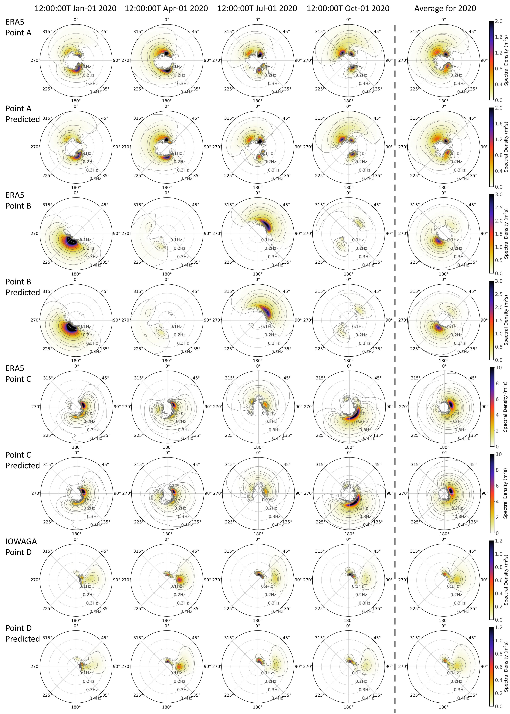

# README

This is the official implementation of the paper "Physics-guided Deep Learning for Modelling Single-Point Wave Spectra using Wind Inputs of Two Resolutions" by [Tianxiang Gao](https://github.com/oaeen), [Haoyu Jiang](https://orcid.org/0000-0002-3995-7382)).

## Abstract

Directional Wave Spectra (DWSs) are essential for various applications such as seafaring and ocean engineering. Traditionally, DWSs are modelled with numerical wave models, which, despite their solid physical basis, are often computationally expensive. For any given point in the ocean, once the historical wind fields that could affect this point are known, the current DWS at this location can be largely determined. This is because local wave energy is generated by either local winds or historical remote winds. This characteristic can be leveraged for the statistical modelling of single-point DWSs. This study presents a deep learning approach to directly model single-point DWS using wind inputs. Two scales of wind data are utilized as model inputs: a high-resolution, small-area, short-time local wind field for local wind-sea spectra, and a low-resolution, large-area, long-time wind field for remotely generated swell spectra. A tailored network architecture is developed to capture the relevant information from both wind scales. The performance of the proposed model was evaluated using both open ocean spectra from ERA5 and coastal spectra from numerical wave hindcasts. Results indicate that the deep learning model can effectively and efficiently simulate DWSs in both open oceans and coastal regions without relying on predefined spectral shapes, demonstrating its potential for applications in wave forecasting and wave climate studies. 





## How to Use

### Requirements

use requirements.txt to install the required packages

```bash
pip install -r requirements.txt
```

### Data Preprocessing

#### Download Data

The data used in this study is available at [ERA5](https://cds.climate.copernicus.eu/), [IFREMER](https://www.umr-lops.fr/Donnees/Vagues).

#### Extract and Scale Data

Data can be extracted and scaled using the scripts in utils/preprocess.

#### Train the Model

The model can be trained using the script in 'run_all_params.py'. Experiment parameters can be adjusted within the Config class to tailor the training process to specific needs.


#### Test the Model

To test the model, we provide a preprocessed dataset and a pretrained model. After downloading the [dataset](https://huggingface.co/datasets/oaeen/wind2dws/tree/main) and [model](https://huggingface.co/oaeen/wind2dws/tree/main) from huggingface , modify the data storage location in the Config class. Testing can be performed using the run_all_params.py script by setting eval=True. This setup ensures that the model runs in evaluation mode using the preloaded data and model parameters.


## Code

The code is available at [wind2dws](https://github.com/oaeen/wind2dws).